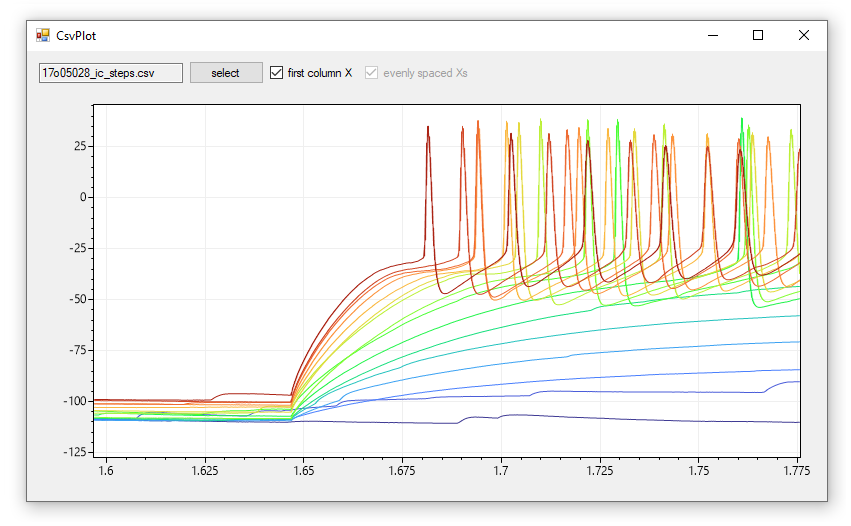
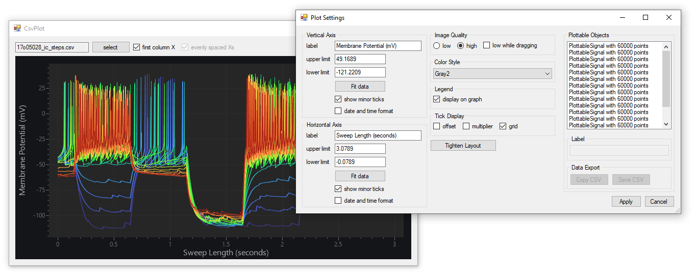

# CsvPlot
**CsvPlot makes it easy to interactively display data stored in CSV files.** Unlike programs like Excel, CsvPlot is designed for _interactive_ (left-click-drag pan, right-click-drag zoom) highspeed data exploration. 

**Quickstart:** Drag/drop a CSV file onto CsvPlot to get started! Sample CSV files are in the [data](data) folder.

**Customization:** Use the right-click menu to add labels, set axis limits, customize the style of the plot, and more...

### Download

> ⚠️ This software is still in development. You can use it by compiling from source code, or come back later and a click-to-run EXE will be available for download.
